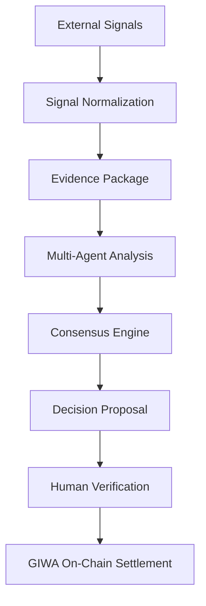
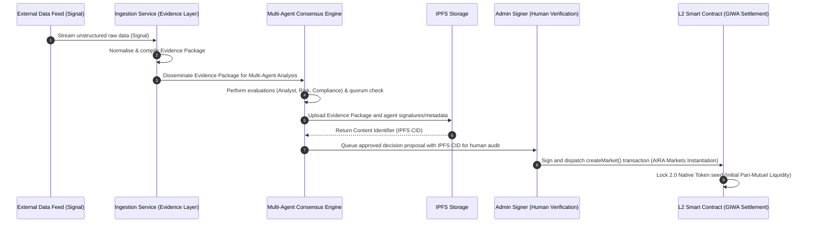
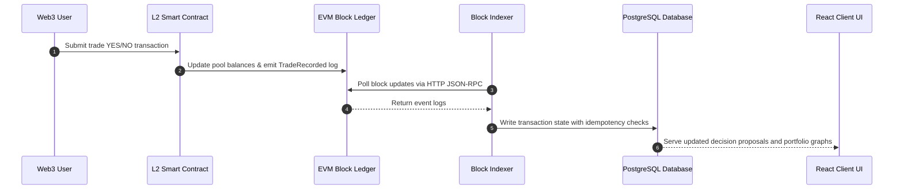

# AIRA Protocol: System Architecture
### Transparent AI Decisions. Verifiable on GIWA.

---

## 1. High-Level Architecture

AIRA is a general-purpose, verifiable AI decision layer that decouples off-chain cognitive agent consensus from immutable smart contract settlement. It executes an 8-stage unified lifecycle to transform unstructured external signals into cryptographically anchored execution outputs on-chain:

By isolating heavy AI computation off-chain, the protocol avoids high gas costs and execution latency. By keeping all asset custody on-chain, user funds remain fully protected by smart contracts; even in the event of an off-chain server crash or AI model hallucination, the integrity of the ledger and user balances is maintained.

---

## 2. Core Services

The protocol relies on several core services, each defined by strict boundaries and design rationales:

### I. Data Ingestion & Evidence Service
*   **Responsibility**: Periodically queries real-world feeds (e.g., news, financials, sports), normalizes raw JSON data, and compiles it into structured **Evidence Packages** (which encapsulate normalized signals, source metadata, timestamps, and confidence inputs).
*   **Service Boundary**: Inputs are external REST APIs; outputs are structured Evidence Packages stored in the persistent database and emitted to the internal event bus.
*   **Why it exists**: Guarantees that every decision proposal is backed by a verifiable record of evidence before entering downstream agent review processes.

### II. AI Sentiment Service (Neural Processor)
*   **Responsibility**: Evaluates Evidence Packages, analyzes sentiment, and generates structured binary (YES/NO) decision proposals.
*   **Service Boundary**: Inputs are Evidence Packages; outputs are structured proposal schemas containing categories, questions, exspiries, and confidence parameters.
*   **Why it exists**: Translates qualitative evidence inputs into quantitative decision proposal parameters.

### III. Multi-Agent Consensus Engine
*   **Responsibility**: Group of specialized verification agents (Analyst, Risk, Compliance) that act as quality gatekeepers by performing semantic reasoning, temporal feasibility, policy compliance, and safety evaluations.
*   **Service Boundary**: Inputs are AI proposals; outputs are approved proposals emitted to the administrative queue.
*   **Why it exists**: Prevents weak, insecure, or policy-violating proposals from reaching execution pipelines.

### IV. Unified Event Bus
*   **Responsibility**: Acts as the central, asynchronous broker for all off-chain system updates (signals received, decisions proposed, log errors).
*   **Service Boundary**: Acts as an internal publisher-subscriber registry across all Node.js backend processes.
*   **Why it exists**: Decouples the ingestion pipeline, AI agents, and indexing services, preventing synchronous blocking and network lag.

### V. Multi-Chain Registry
*   **Responsibility**: Centralizes provider endpoints, block explorers, and contract ABIs across separate EVM blockchains.
*   **Service Boundary**: Exposes unified loader functions (`ProviderFactory`, `ContractFactory`) to both frontend and backend modules.
*   **Why it exists**: Abstracts differences across multiple L2 networks, allowing the protocol to scale to new chains with zero code changes.

---

## 3. Data Flow: Protocol Decision Pipeline & Sandbox Instantiation

The lifecycle of converting real-world information into a verifiable decision state follows a structured pipeline, culminating in the initialization of the AIRA Markets reference application's prediction pool:

---

## 4. Event Flow: AIRA Markets Application Sync Loop

To keep the client interface for the AIRA Markets sandbox responsive, on-chain trading and pool state updates are synchronized to the local cache via an event-driven indexing loop:

---

## 5. Architectural Tiers

### I. Backend (Cognitive Processing)
*   **Responsibility**: Runs the continuous ingestion scrapers, compiles Evidence Packages, drives the Multi-Agent Consensus Engine, exposes the REST API server, and logs auditable actions to the local filesystem.
*   **Why it exists**: Offloads high-computation AI calculations and database querying from the client browser and the blockchain ledger.

### II. Frontend (User Interface)
*   **Responsibility**: Serves as the user-facing web dashboard. Connects user Web3 wallets, displays active AI-proposed decision proposals, renders real-time pricing curves, and formats transaction notifications.
*   **Why it exists**: Abstracts low-level smart contract functions and database queries into a seamless Web3 dashboard.

### III. Smart Contracts (Settlement Engine)
*   **Responsibility**: Serves as the ultimate trust anchor. Handles secure asset custody and execution logic for applications built on the protocol, such as managing pool ratios, minting option shares, holding deposited funds, and locking optimistic dispute bonds for the AIRA Markets sandbox.
*   **Why it exists**: Guarantees that asset custody, trade math, and winnings distributions are executed transparently and immune to manipulation.

### IV. Indexer (Blockchain Sync)
*   **Responsibility**: Executes stateless HTTP polling of new blocks, parses transaction logs, and updates the local database.
*   **Why it exists**: Resolves the RPC rate-limit crashes and filter timeouts typical of WebSockets, maintaining stable synchronization between the blockchain and the cached database.

### V. Storage (Persistence Cache)
*   **Responsibility**: Retains structured historical records of market statistics, block checkpoints, and user portfolios.
*   **Why it exists**: The EVM ledger is not optimized for complex queries (such as sorting, filtering, or time-series charting). A relational database provides the performance required for the client UI.

### VI. Infrastructure (Hosting Environment)
*   **Responsibility**: Host systems for the backend API, L2 RPC nodes, IPFS gateways, and static CDNs for browser client hosting.
*   **Why it exists**: Ensures high service availability, secure data pipelines, and low latency.

---

## 6. Future Expansion

The architecture is designed to support three key future enhancements:
1.  **Multi-Engine Consensus**: Upgrading the Consensus Engine to require consensus voting (e.g., 3 out of 5 agents approving a proposal) before it is queued.
2.  **MPC Administrative Signing**: Replacing the single-signature Admin validation with a Multi-Party Computation (MPC) or Multi-Sig threshold structure to eliminate single-point-of-failure vulnerabilities.
3.  **Zero-Knowledge Reasoning Proofs**: Integrating ZK-provers to cryptographically verify that the off-chain AI processed the exact news inputs without revealing proprietary LLM prompts.

> **Current Status**: The above are planned `Roadmap` features. The protocol currently operates with single-admin ECDSA signing on GIWA Sepolia Testnet. When LLM API keys are not configured, the Consensus Engine runs in structured-simulation mode with deterministic mock responses.

---

## 7. Why GIWA

The AIRA Protocol relies on Dunamu's **GIWA OP Stack L2** network as its core settlement layer. The network provides specific advantages crucial to off-chain verifiable AI systems:
*   **Efficient Settlement**: Enables low-gas, pari-mutuel pool creations, micro-trades, and dispute settlements that are economically unviable on Ethereum Layer 1.
*   **Verifiable AI Execution**: Low execution fees support the frequent administrative signatures required to commit consensus proposals trustlessly.
*   **Low-Cost On-Chain Evidence Anchoring**: Allows the permanent anchoring of detailed IPFS Content Identifiers (CIDs) mapping to Evidence Packages and agent audits directly within event log states, establishing complete public transparency.
*   **Developer Experience**: Combines standard EVM tooling compatibility (ethers, viem, Hardhat) with high RPC transaction processing speeds, streamlining sandbox testing and contract verification.
*   **Scalable Execution**: Rapid block times facilitate high transaction throughput, ensuring consensus engine proposals are queued and initialized with sub-second finality.
*   **Future Protocol Expansion**: The OP Stack's scalable design aligns with future protocol updates, including Multi-Party Computation (MPC) administrative multi-sigs and Zero-Knowledge (ZK) execution verification tools.
