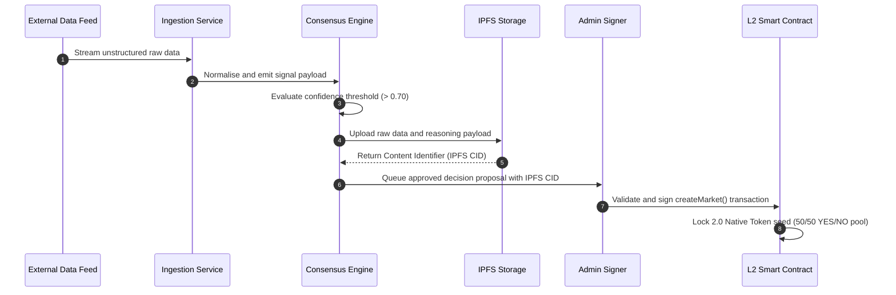
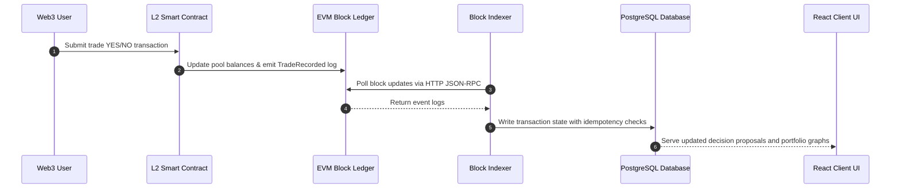

# AIRA Protocol: System Architecture
### Decoupled Cognitive Ingestion and Immutable Blockchain Settlement

---

## 1. High-Level Architecture

The AIRA Protocol is designed around a strict **Separation of Concerns**. Computational cognitive labor (data scraping, text analysis, and sentiment valuation) is separated from economic settlement (asset custody, token distribution, and dispute resolution). 

By isolating heavy AI computation off-chain, the protocol avoids high gas costs and execution latency. By keeping all asset custody on-chain, user funds remain fully protected by smart contracts; even in the event of an off-chain server crash or AI model hallucination, the integrity of the ledger and user balances is maintained.

```
                  ┌──────────────────────────────────────────────┐
                  │            COGNITIVE LAYER (Off-Chain)       │
                  │  ┌────────────────┐      ┌────────────────┐  │
                  │  │ Ingestion Feeds│ ───> │Consensus Engine│  │
                  │  └────────────────┘      └────────────────┘  │
                  └──────────────────────────┬───────────────────┘
                                             │(Decision Proposal)
                                             ▼
                  ┌──────────────────────────────────────────────┐
                  │            INTEGRATION BUS & CACHE           │
                  │  ┌────────────────┐      ┌────────────────┐  │
                  │  │ Local Event Bus│      │ PostgreSQL DB  │  │
                  │  └───────┬────────┘      └────────▲───────┘  │
                  └──────────┼────────────────────────┼──────────┘
                             │ (Transaction Trigger)  │ (Block Indexing)
                             ▼                        │
                  ┌──────────────────────────┬────────┴──────────┐
                  │            SETTLEMENT LAYER (On-Chain)       │
                  │  ┌────────────────┐      ┌────────────────┐  │
                  │  │ Smart Contract │ <─── │   EVM Ledger   │  │
                  │  └───────┬────────┘      └────────────────┘  │
                  └──────────┼───────────────────────────────────┘
                             │ (User Interactions)
                             ▼
                  ┌──────────────────────────────────────────────┐
                  │             CLIENT LAYER (Browser)           │
                  │  ┌────────────────────────────────────────┐  │
                  │  │            React Web Dashboard         │  │
                  │  └────────────────────────────────────────┘  │
                  └──────────────────────────────────────────────┘
```

---

## 2. Core Services

The protocol relies on several core services, each defined by strict boundaries and design rationales:

### I. Data Ingestion Service
*   **Responsibility**: Periodically queries real-world feeds (e.g., news, financials, sports) and normalizes raw JSON data into standardized data structures.
*   **Service Boundary**: Inputs are external REST APIs; outputs are normalized data payloads emitted to the internal event bus.
*   **Why it exists**: Isolates the rest of the application from changes in external API formatting and rate-limiting constraints.

### II. AI Sentiment Service (Neural Processor)
*   **Responsibility**: Evaluates normalized data signals, analyzes market sentiment, and generates structured binary (YES/NO) decision proposals.
*   **Service Boundary**: Inputs are normalized data signals; outputs are structured proposal schemas containing categories, questions, exspiries, and confidence parameters.
*   **Why it exists**: Translates qualitative natural language sources into quantitative risk parameters.

### III. Multi-Agent Consensus Engine
*   **Responsibility**: Group of specialized verification agents (Analyst, Risk, Compliance) that act as quality gatekeepers by auditing decision proposals against a minimum 0.70 confidence threshold.
*   **Service Boundary**: Inputs are AI proposals; outputs are approved proposals emitted to the administrative queue.
*   **Why it exists**: Filters out low-interest or highly ambiguous proposals before they require human approval or contract gas fees.

### IV. Unified Event Bus
*   **Responsibility**: Acts as the central, asynchronous broker for all off-chain system updates (signals received, decisions proposed, log errors).
*   **Service Boundary**: Acts as an internal publisher-subscriber registry across all Node.js backend processes.
*   **Why it exists**: Decouples the ingestion pipeline, AI agents, and indexing services, preventing synchronous blocking and network lag.

### V. Multi-Chain Registry
*   **Responsibility**: Centralizes provider endpoints, block explorers, and contract ABIs across separate EVM blockchains.
*   **Service Boundary**: Exposes unified loader functions (`ProviderFactory`, `ContractFactory`) to both frontend and backend modules.
*   **Why it exists**: Abstracts differences across multiple L2 networks, allowing the protocol to scale to new chains with zero code changes.

---

## 3. Data Flow

The lifecycle of converting real-world information into an on-chain contract state follows a structured pipeline:



---

## 4. Event Flow

To keep the client user interface responsive, on-chain state updates are synchronized to the local cache via an event-driven indexing loop:



---

## 5. Architectural Tiers

### I. Backend (Cognitive Processing)
*   **Responsibility**: Runs the continuous ingestion scrapers, drives the Multi-Agent Consensus Engine, exposes the REST API server, and logs auditable actions to the local filesystem.
*   **Why it exists**: Offloads high-computation AI calculations and database querying from the client browser and the blockchain ledger.

### II. Frontend (User Interface)
*   **Responsibility**: Serves as the user-facing web dashboard. Connects user Web3 wallets, displays active AI-proposed decision proposals, renders real-time pricing curves, and formats transaction notifications.
*   **Why it exists**: Abstracts low-level smart contract functions and database queries into a seamless Web3 dashboard.

### III. Smart Contracts (Settlement Engine)
*   **Responsibility**: Serves as the ultimate trust anchor. Enforces pool ratios, handles YES/NO token minting, holds deposited funds, and locks optimistic dispute bonds.
*   **Why it exists**: Guarantees that asset custody, trade math, and winnings distributions are executed transparently and immune to manipulation.

### IV. Indexer (Blockchain Sync)
*   **Responsibility**: Executes stateless HTTP polling of new blocks, parses transaction logs, and updates the local database.
*   **Why it exists**: Resolves the RPC rate-limit crashes and filter timeouts typical of WebSockets, maintaining stable synchronization between the blockchain and the cached database.

### V. Storage (Persistence Cache)
*   **Responsibility**: Retains structured historical records of market statistics, block checkpoints, and user portfolios.
*   **Why it exists**: The EVM ledger is not optimized for complex queries (such as sorting, filtering, or time-series charting). A relational database provides the performance required for the client UI.

### VI. Infrastructure (Hosting Environment)
*   **Responsibility**: Host systems for the backend API, L2 RPC nodes, IPFS gateways, and static CDNs for browser client hosting.
*   **Why it exists**: Ensures high service availability, secure data pipelines, and low latency.

---

## 6. Future Expansion

The architecture is designed to support three key future enhancements:
1.  **Multi-Engine Consensus**: Upgrading the Consensus Engine to require consensus voting (e.g., 3 out of 5 agents approving a proposal) before it is queued.
2.  **MPC Administrative Signing**: Replacing the single-signature Admin validation with a Multi-Party Computation (MPC) or Multi-Sig threshold structure to eliminate single-point-of-failure vulnerabilities.
3.  **Zero-Knowledge Reasoning Proofs**: Integrating ZK-provers to cryptographically verify that the off-chain AI processed the exact news inputs without revealing proprietary LLM prompts.
