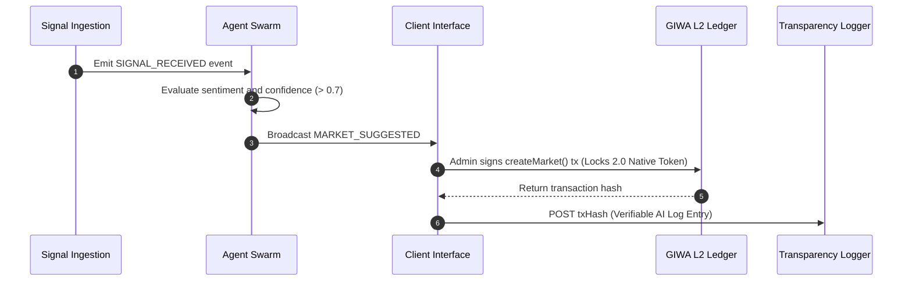

# AIRA Protocol Architecture
### Powered by GIWA

---

## 1. Executive Summary

### Why This Exists
High fees and transaction confirmation latencies on L1 EVM chains restrict prediction protocols to high-value, slow-moving markets. The **AIRA Protocol** architecture is engineered as a high-frequency, low-friction framework designed to modularize prediction mechanics.

### What Problem It Solves
It solves the data-ingestion-to-onchain-deployment bottleneck. By using specialized AI agent modules that continuously scan online information spaces and filter inputs using strict confidence thresholds, the protocol automates the proposal of prediction topics. This removes manual research overhead and coordinates trustless, peer-to-peer risk management.

### Why It Matters
This design decouples decision intelligence (AI) from execution settlement (smart contracts). Smart contracts act as the absolute final arbiter of asset custody, while the AI acts as a programmatic broker. This enforces absolute capital safety even if an AI model exhibits hallucinations.

### How It Benefits GIWA
- **Low Gas Optimization Showcase**: The architecture leverages Dunamu's **GIWA OP Stack L2** to execute continuous indexer sweeps, market updates, and trade state alterations at a fraction of a cent.
- **Developer Ecosystem Leverage**: By establishing a modular configuration registry (`config/chains`), the protocol sets a template for other developers to deploy multi-chain services natively targeting GIWA.

---

## 2. Modular Architecture Layers

### 1. Data Ingestion & Sentiment Analysis (Backend Service)
- **Ingestion Module (`server/services/signal_ingestion.ts`)**: Streams structured signals from CoinGecko, Hacker News, ESPN, and Reddit.
- **AI Sentiment Service (`server/services/ai_service.ts`)**: Estimates trend vectors, structures market propositions, and generates confidence scores.
- **Autonomous Agent Swarms**: Monitor the internal event bus and filter proposals through a minimum 0.70 confidence coefficient.

### 2. Multi-Chain Abstraction Layer
- **Registry Schema (`config/chains/`)**: Standardizes properties (RPC URL, native currency symbols, block explorers) across chains.
- **Unified Object Factories (`/services/`)**:
  - `ProviderFactory`: Standardizes connection checks and retry logic.
  - `ContractFactory`: Standardizes loading deployment ABIs and checking checksum addresses.

### 3. Smart Contract Settlement Layer (Solidity)
- **`AiraMarketProtocol.sol`**: Governs pool logic, share tokens, and settlements.
- **Storage Variable Packing**: Optimizes gas fees on L2 by compacting market data inside 32-byte storage slots.

### 4. Client Dashboard (React / Zustand)
- **Network Interface (`src/lib/network/`)**: Configures Wagmi/RainbowKit dynamically using the active chain configuration.

---

## 3. Data & Transaction Flows

