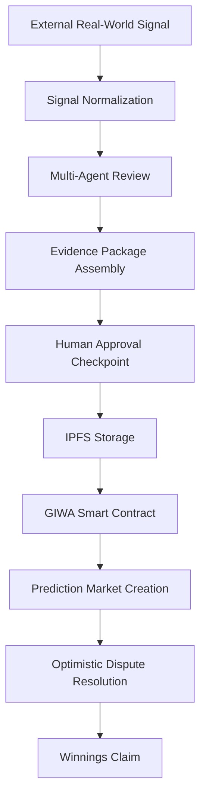

# AIRA Protocol
### A Transparent Multi-Agent Decision Protocol demonstrated through Prediction Markets on GIWA.

[](file:///home/oyeolorun/AiraMarKet/LICENSE)
[](https://sepolia-explorer.giwa.io)
[](file:///home/oyeolorun/AiraMarKet/docs/developer/local_development.md)
[](file:///home/oyeolorun/AiraMarKet/contracts/AiraMarket.sol)

> [!IMPORTANT]
> **Core Value Proposition**  
> *"AIRA doesn't ask users to trust AI. It gives them the tools to inspect how AI reached a decision before that decision is committed on-chain."*

---

> [!NOTE]
> **30-Second Summary**  
> AIRA is a transparent multi-agent decision protocol demonstrated through prediction markets. Multiple specialized AI agents perform specialized analysis using distinct evaluation roles, produce transparent reasoning, pass multi-agent review, and store structured evidence packages on IPFS before market creation. Rather than relying on opaque AI outputs, AIRA exposes the reasoning, supporting evidence, and review pipeline behind every approved market before it is executed on GIWA.

| Parameter | Status / Details |
| :--- | :--- |
| **Network** | GIWA Sepolia Testnet (Chain ID: `91342`) |
| **Deployment** | Verified (`0xBDCd79e468a05BaD60cc0822Df42c11B4e0E4f3D`) |
| **Explorer** | Available ([GIWA Explorer](https://sepolia-explorer.giwa.io)) |
| **Wallet Stack** | RainbowKit / Wagmi / Viem |
| **Status** | Active on GIWA Sepolia (Live MVP) |

---

## What Makes AIRA Different?

Unlike traditional platforms that rely on manual market creation or opaque AI systems, AIRA combines:

- **Multi-agent AI reasoning** instead of a single AI response.
- **Structured evidence packages** stored on IPFS and referenced on-chain.
- **On-chain verification through GIWA** for settlement and auditability.
- **Human approval required before on-chain market creation.**

This approach makes AI-assisted prediction markets transparent, inspectable, and verifiable.

---

## Why AI?

Real-world events emerge faster than traditional prediction markets can be created manually. AIRA uses AI to assist with evidence collection, proposal generation, and structured reasoning, while preserving human oversight and transparent verification before execution on GIWA.

### Why This Matters Now

As AI becomes increasingly involved in decision-making, users need systems that explain how conclusions were reached—not just the conclusions themselves. AIRA provides that transparency by combining AI reasoning, human oversight, and on-chain verification.

### Why AI Computation is Off-Chain

AIRA intentionally separates AI computation from blockchain execution. Computationally intensive reasoning occurs off-chain, while only the resulting evidence reference, proposal metadata, and settlement logic are committed on GIWA. This minimizes execution costs while preserving auditability and deterministic settlement.

---

## Why This Architecture Fits GIWA

- **Low Gas Costs**: Enables frequent market creation, administrative signing, and micro-trade execution without high cost barriers.
- **Fast Confirmations**: Rapid L2 block times improve prediction market UX and transaction finality.
- **EVM Tooling Compatibility**: Simplifies smart contract deployment, viem/wagmi integration, and RPC indexer synchronization.
- **Transparent Ledger**: Immutable on-chain state complements off-chain AI analysis for complete decision auditability.

---

## Protocol Principles

- **Human approval is required before on-chain market creation.**
- **AI assists rather than autonomously executes.**
- **Every market is supported by inspectable evidence.**
- **Settlement is transparent and verifiable on GIWA.**
- **The protocol is designed for extensibility across pluggable AI providers.**

---

## Security Model

- **Human approval required** before on-chain deployment.
- **AI outputs are reviewable** before execution.
- **Evidence packages are content-addressed via IPFS** and referenced on-chain.
- **Smart contract settlement is deterministic** on GIWA.
- **Dispute resolution follows an optimistic challenge model**.

---

## Technical Architecture

`AI Layer` ➔ `Review Pipeline` ➔ `Evidence Layer` ➔ `Settlement Layer` ➔ `Application Layer`

1. **AI Layer**: Supports configurable LLM providers through an abstraction layer, with deterministic fallback logic when external AI services are unavailable.
2. **Review Pipeline**: Orchestrates multi-agent reviews (Analyst, Risk, Compliance) to approve proposals based on quorum thresholds.
3. **Evidence Layer**: Normalizes real-world signal feeds into deterministic JSON payloads pinned to IPFS CIDs.
4. **Settlement Layer**: Manages market creation, pre-seeded liquidity, trading, optimistic dispute resolution, and payouts on GIWA Sepolia (`0xBDCd79e468a05BaD60cc0822Df42c11B4e0E4f3D`).
5. **Application Layer**: Delivers a responsive 7-module interface for signal creation, interactive trading, and cryptographic audits.

---

## End-to-End Decision Lifecycle

```
External Signal ➔ Signal Normalization ➔ Multi-Agent Review ➔ Evidence Package ➔ Human Approval ➔ IPFS Storage ➔ GIWA Smart Contract ➔ Prediction Market ➔ Settlement ➔ Claim
```



---

## Features
*   **Decoupled Cognitive Layer**: Isolates intensive AI computations off-chain while anchoring custody and execution rules securely on-chain.
*   **First Reference Application (AIRA Markets)**: The flagship prediction and risk market application built on the protocol, demonstrating agent-driven creation and optimistic resolution of binary decision pools.
*   **Pre-Seeded Liquidity Pools**: Pre-seeded liquidity minimizes initial pricing distortion during early market participation.
*   **Vibrant Interface**: A mobile-responsive React dashboard featuring Web3 wallet connectors (Wagmi/RainbowKit) and direct explorer notifications.
*   **Fault-Tolerant Indexer**: Relies on stateless polling to eliminate WebSocket disconnections and node rate-limit crashes.

---

## Current MVP Metrics

- **Live Smart Contract**: Deployed on GIWA Sepolia (`0xBDCd79e468a05BaD60cc0822Df42c11B4e0E4f3D`).
- **Smart Contract Tests**: `9/9` unit tests passing (`npx hardhat test`).
- **Pipeline Integration Tests**: `5/5` decision pipeline tests passing (`npm run test:consensus`).
- **Application Modules**: `7` production modules (Landing, Feed, Creator, Terminal, Explorer, Registry, Portfolio).
- **Specialized AI Evaluation Roles**: `3` distinct roles (Analyst, Risk, Compliance).
- **Audit Interface**: 4-tab Explorer (Evidence, Swarm, On-Chain, Raw JSON).
- **Web3 Integration**: Wagmi v2, Viem, and RainbowKit wallet support.
- **Storage**: IPFS Evidence CID content addressing.
- **UI Responsiveness**: Fully responsive mobile/desktop interfaces.

---

## Current MVP Limitations

- **Provider Abstraction**: Current MVP relies on configurable LLM providers through an abstraction layer.
- **Human Oversight**: Market creation requires human-in-the-loop approval before on-chain execution.
- **Reputation Systems**: Agent historical calibration and reputation scoring are scheduled for future roadmap phases.
- **Governance Evolution**: Decentralized governance parameter control will be introduced post-testnet evaluation.

---

## Protocol Verification Metrics

The following metrics represent verified protocol capabilities and testing outcomes:
*   **Infrastructure & Integration**:
    *   `[x]` Multi-chain architecture configuration
    *   `[x]` Dunamu's GIWA L2 integration verified
    *   `[x]` Production diagnostics & health monitoring active
    *   `[x]` Standardized structured logging implemented
*   **Consensus & Intelligence**:
    *   `[x]` Multi-Agent Review Pipeline implemented
    *   `[x]` Three specialized AI agent roles (Analyst, Risk, Compliance) active
    *   `[x]` Collaborative quorum thresholds implemented (66% approval quorum)
    *   `[x]` Agent evaluation reasoning persisted in database cache
*   **Code Quality & Verification**:
    *   `[x]` Live Deployment Status: Active on GIWA Sepolia Testnet
    *   `[x]` 9/9 smart contract unit tests passing
    *   `[x]` 5/5 decision pipeline integration tests passing
    *   `[x]` Production frontend build compiled and verified

> **AIRA Protocol demonstrates a practical architecture for combining AI-assisted analysis, human review, transparent evidence, and on-chain execution within a prediction market workflow.**

---

## Resources

- **GitHub Repository**: [0xaje/AiraMarKet](https://github.com/0xaje/AiraMarKet)
- **Live MVP Application**: [AIRA Protocol App](https://airamarket.vercel.app)
- **Smart Contract Address**: [`0xBDCd79e468a05BaD60cc0822Df42c11B4e0E4f3D`](https://sepolia-explorer.giwa.io/address/0xBDCd79e468a05BaD60cc0822Df42c11B4e0E4f3D)
- **Block Explorer**: [GIWA Sepolia Explorer](https://sepolia-explorer.giwa.io)
- **Documentation Hub**: [Executive Overview](file:///home/oyeolorun/AiraMarKet/docs/EXECUTIVE_OVERVIEW.md)

---

## License
This project is licensed under the MIT License. See [LICENSE](file:///home/oyeolorun/AiraMarKet/LICENSE) for more details.