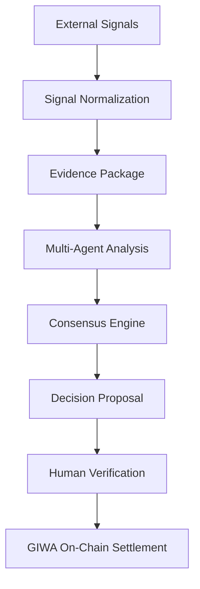

# AIRA Protocol: Transparent AI Decisions. Verifiable on GIWA.
### Decoupled Cognitive Consensus and Cryptographically Anchored Settlement

[](file:///home/oyeolorun/AiraMarKet/LICENSE)
[](https://sepolia-explorer.giwa.io)
[](file:///home/oyeolorun/AiraMarKet/docs/developer/local_development.md)
[](file:///home/oyeolorun/AiraMarKet/contracts/AiraMarket.sol)

---

## Tagline
Transparent AI Decisions. Verifiable on GIWA.

---

## Mission
To establish a cryptographically verifiable and decentralized trust substrate for AI cognitive labor by bridging off-chain agent consensus with on-chain execution and audit logging.

---

## Unified Protocol Lifecycle

The AIRA Protocol is governed by an 8-stage unified protocol lifecycle that decouples off-chain cognitive consensus from immutable blockchain settlement:



---

The protocol is comprised of six main layers:
1.  **Ingestion & Evidence Layer**: Translates unstructured incoming signals into verifiable Evidence Packages, linking normalized source feeds, metadata origin schemas, and confidence inputs.
2.  **Multi-Agent Consensus Engine**: Collaborative swarm agents (Analyst, Risk, Compliance) performing Multi-Agent Analysis on Evidence Packages to approve decision proposals.
3.  **Smart Contract Settlement Engine (`AiraMarketProtocol.sol`)**: An optimized Solidity execution layer governing pari-mutuel pools, YES/NO token minting, and payouts for applications built on the protocol (e.g., AIRA Markets).
4.  **Cryptographic Verification (IPFS Anchoring)**: Anchors detailed IPFS CIDs mapping to Evidence Packages and agent audits directly within EVM event log states, establishing complete public transparency.
5.  **Optimistic Oracle Settlements**: Conclusive resolution determined via economic incentives; outcome proposers stake a slashing bond, subject to verification challenges.
6.  **Stateless Block Indexer**: A database ingestion pipeline that monitors the ledger via HTTP JSON-RPC polling, using transaction-level database idempotency to maintain absolute sync alignment.

---

## Why GIWA

The AIRA Protocol relies on Dunamu's **GIWA OP Stack L2** network as its core settlement layer. The network provides specific advantages crucial to off-chain verifiable AI systems:
*   **Efficient Settlement**: Enables low-gas, pari-mutuel pool creations, micro-trades, and dispute settlements that are economically unviable on Ethereum Layer 1.
*   **Verifiable AI Execution**: Low execution fees support the frequent administrative signatures required to commit consensus proposals trustlessly.
*   **Low-Cost On-Chain Evidence Anchoring**: Allows the permanent anchoring of detailed IPFS Content Identifiers (CIDs) mapping to Evidence Packages and agent audits directly within event log states, establishing complete public transparency.
*   **Developer Experience**: Combines standard EVM tooling compatibility (ethers, viem, Hardhat) with high RPC transaction processing speeds, streamlining sandbox testing and contract verification.
*   **Scalable Execution**: Rapid block times facilitate high transaction throughput, ensuring consensus engine proposals are queued and initialized with sub-second finality.
*   **Future Protocol Expansion**: The OP Stack's scalable design aligns with future protocol updates, including Multi-Party Computation (MPC) administrative multi-sigs and Zero-Knowledge (ZK) execution verification tools.

---

## Features
*   **Decoupled Cognitive Layer**: Isolates intensive AI computations off-chain while anchoring custody and execution rules securely on-chain.
*   **First Reference Application (AIRA Markets)**: The flagship prediction and risk market application built on the protocol, demonstrating agent-driven creation and optimistic resolution of binary decision pools.
*   **Pre-Seeded Liquidity Pools**: Contract-enforced native token seeding (2.0 tokens split 50/50) to prevent early-trader curve manipulation.
*   **Vibrant Interface**: A mobile-responsive React dashboard featuring Web3 wallet connectors (Wagmi/RainbowKit) and direct explorer notifications.
*   **Fault-Tolerant Indexer**: Relies on stateless polling to eliminate WebSocket disconnections and node rate-limit crashes.

---

## Technology Stack
*   **Smart Contracts**: Solidity, Hardhat, Ethers.js v6
*   **Blockchain Ledger**: Flagship GIWA Sepolia L2 Network (supporting multi-chain EVM config for Mantle)
*   **Indexer & Data Pipeline**: Node.js, Prisma ORM, PostgreSQL
*   **Client Interface**: React, Vite, TailwindCSS, Zustand
*   **Web3 Integrations**: Wagmi, Viem, RainbowKit

---

## Quick Start

### Prerequisites
*   Node.js (v18+)
*   PostgreSQL running database instance

### Setup
1.  Clone the protocol repository:
    ```bash
    git clone https://github.com/0xaje/AiraMarKet.git
    cd AiraMarKet
    ```
2.  Install standardized package dependencies:
    ```bash
    npm install
    ```
3.  Initialize environment configurations (`.env`):
    ```bash
    PRIVATE_KEY="0x..."
    DATABASE_URL="postgresql://..."
    RPC_URL="https://sepolia-rpc.giwa.io"
    ```
4.  Synchronize the PostgreSQL schemas and boot the server/indexer:
    ```bash
    npx prisma db push
    npm run server
    ```
5.  Start the client development server:
    ```bash
    npm run dev
    ```
    The React UI will run at `http://localhost:5173`.

---

## Repository Structure
```
├── config/                 # Core network and protocol settings registries
├── contracts/              # Solidity source contracts
├── deployments/            # Chain-specific deployment addresses and ABIs
├── docs/                   # Developer guides and executive reports
├── scripts/                # Hardhat deployment and validation tasks
├── server/                 # AI agents, event buses, and block indexers
├── services/               # Multi-chain provider and contract factories
├── src/                    # Client React dashboard components
└── test/                   # Smart contract unit tests
```

---

## Roadmap
*   **Phase 1 (Completed)**: Core smart contract validation, local sandbox development, multi-agent consensus engine implementation, testnet deployment on GIWA Sepolia L2, and event indexer hardening.
*   **Phase 2 (Q3 2026 - Production API & Infrastructure Scaling)**:
    *   **Milestone 2.1: Cloud Infrastructure Deployment**
        *   `[ ]` Sub-milestone 2.1.1: Deploy PostgreSQL indexer and Node.js API server to managed cloud infrastructure (Render / Railway) with zero-downtime health probes.
        *   `[ ]` Sub-milestone 2.1.2: Enforce TLS 1.3 encryption, CORS domain whitelisting, and strict request rate-limiting middleware.
    *   **Milestone 2.2: Production LLM Provider Integration**
        *   `[ ]` Sub-milestone 2.2.1: Wire production Gemini 1.5 Pro & OpenAI GPT-4o API keys into the Consensus Engine provider pipeline with automatic fallback models.
        *   `[ ]` Sub-milestone 2.2.2: Implement response caching, token usage tracking, and multi-agent latency optimization.
    *   **Milestone 2.3: Live Telemetry Webhooks & Explorer Upgrades**
        *   `[ ]` Sub-milestone 2.3.1: Connect real-time Webhook telemetry ingestors (Chainlink Functions & Pyth Oracles) to replace polling scrapers.
        *   `[ ]` Sub-milestone 2.3.2: Upgrade public Protocol Explorer (`/explorer`) with WebSocket event subscriptions for real-time GIWA L2 block mining alerts.
*   **Phase 3 (Q4 2026)**: Deploying to GIWA Mainnet, integrating third-party decentralized oracle networks, and initiating liquidity provider incentives.
*   **Phase 4 (Q1 2027)**: Transitioning protocol parameters (fee splits, confidence thresholds) to a Decentralized Autonomous Organization (DAO) and releasing developer SDKs to allow partners to build custom AI agents.

---

## Documentation
*   [Executive Overview](file:///home/oyeolorun/AiraMarKet/docs/EXECUTIVE_OVERVIEW.md)
*   [Architecture Overview](file:///home/oyeolorun/AiraMarKet/docs/developer/architecture_overview.md)
*   [Local Development Guide](file:///home/oyeolorun/AiraMarKet/docs/developer/local_development.md)
*   [Production Deployment Guide](file:///home/oyeolorun/AiraMarKet/docs/developer/deployment_guide.md)
*   [Diagnostics & Troubleshooting Playbook](file:///home/oyeolorun/AiraMarKet/docs/developer/troubleshooting.md)
*   [Multi-Chain Abstraction Playbook](file:///home/oyeolorun/AiraMarKet/docs/developer/adding_new_chains.md)
*   [AI Consensus Agent Integration Guide](file:///home/oyeolorun/AiraMarKet/docs/developer/adding_new_ai_agents.md)
*   [Coding Standards & Workflow](file:///home/oyeolorun/AiraMarKet/docs/developer/standards.md)
*   [Future Enhancements Playbook](file:///home/oyeolorun/AiraMarKet/docs/developer/future_modules.md)

---

## Contributing
We welcome contributions to the AIRA Protocol. Please read our [Local Development Guide](file:///home/oyeolorun/AiraMarKet/docs/developer/local_development.md) and [Coding Standards & Workflow](file:///home/oyeolorun/AiraMarKet/docs/developer/standards.md) to set up your environment. Ensure that all modifications pass the Hardhat unit tests before opening a Pull Request:
```bash
npx hardhat test
```

---

## Protocol Verification Metrics

The following metrics represent verified protocol capabilities and testing outcomes:
*   **Infrastructure & Integration**:
    *   `[x]` Multi-chain architecture configuration
    *   `[x]` Dunamu's GIWA L2 integration verified
    *   `[x]` Production diagnostics & health monitoring active
    *   `[x]` Standardized structured logging implemented
*   **Consensus & Intelligence**:
    *   `[x]` Multi-Agent Consensus Engine implemented
    *   `[x]` Three specialized AI agents (Analyst, Risk, Compliance) active
    *   `[x]` Collaborative consensus thresholds implemented (66% approval quorum)
    *   `[x]` Agent evaluation reasoning persisted in database cache
*   **Code Quality & Verification**:
    *   `[x]` 9/9 smart contract unit tests passing
    *   `[x]` 5/5 consensus engine integration tests passing
    *   `[x]` Production frontend build compiled and verified

---

## License
This project is licensed under the MIT License. See [LICENSE](file:///home/oyeolorun/AiraMarKet/LICENSE) for more details.