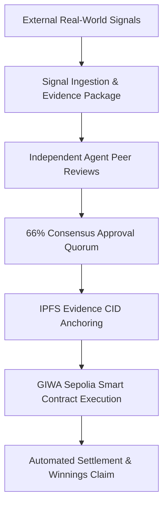

# AIRA Protocol: Executive Overview
### A Multi-Agent AI Decision Protocol for Transparent Prediction Markets, powered by GIWA.

---

## 1. Why This Is Important

Traditional prediction markets and decentralized decision platforms face three major bottlenecks:

1. **Manual Market Creation**: Creating prediction markets is still largely manual, making it slow to react to fast-moving real-world events.
2. **Hard-to-Verify AI Decisions**: AI-generated decisions are difficult to verify when outputs are produced inside opaque black boxes.
3. **Lack of Decision Visibility**: Users have little visibility into how AI reached a conclusion or what evidence was evaluated.

### **The AIRA Solution**
**AIRA allows multiple AI agents to independently analyze a prediction, explain their reasoning, reach consensus, preserve supporting evidence, and anchor that evidence on GIWA.**

Instead of trusting a single prompt or an opaque black box, specialized AI agents evaluate real-world signals, calculate risk parameters, and verify compliance rules. Every decision audit trail is anchored on-chain to **GIWA Sepolia L2**, giving users complete visibility into how conclusions were reached.

---

## 2. Core Capabilities & User Value

- 🤖 **Independent Multi-Agent Peer Reviews**: Multiple AI agents evaluate signal inputs and peer-review every proposal, requiring a 66% consensus quorum before creating a market.
- 🔍 **Verifiable Decision Audit Trail**: Every evidence item, agent evaluation, and confidence score is anchored with an IPFS CID and logged transparently on-chain.
- 💧 **Instant Micro-Liquidity Seeding**: Markets are pre-funded with **`0.000002 GIWA`** seed liquidity on block zero, enabling micro-orders (`0.00002 GIWA`) without high faucet barriers.
- 🏆 **Clear Outcome & Winnings Payouts**: Traders can track active predictions, verify `WON 🏆` or `LOST ❌` statuses, and claim payouts directly into their Web3 wallets.

---

## 3. How It Is Implemented (Technical Architecture)

The protocol decouples off-chain cognitive evaluation from on-chain asset custody across four core layers:

### **Component Layer Breakdown:**

1. **Off-Chain Multi-Agent Consensus Swarm**:
   - **`AnalystAgent`**: Ingests raw signal data and models baseline probability estimates.
   - **`RiskAgent`**: Audits order book depth, volatility indices, and safety circuit breakers.
   - **`ComplianceAgent`**: Enforces oracle dispute rules, timelocks, and protocol compliance.

2. **On-Chain Settlement Engine (`AiraMarketProtocol.sol`)**:
   - Deployed at `0xBDCd79e468a05BaD60cc0822Df42c11B4e0E4f3D` on GIWA Sepolia L2 (Chain ID: `91342`).
   - Governs pari-mutuel pool minting (`buyYes`, `buyNo`), resolution timelocks (`proposeResolution`, `executeResolution`), and proportional winnings transfers (`claimWinnings`).

3. **Storage & Audit Layer**:
   - Supports IPFS evidence anchoring for metadata logs and cryptographic multihash verification.

4. **Frontend Applications**:
   - **Core Feed (`/feed`)**: 4 category streams with status filters and mobile stream view.
   - **AI Creator Lab (`/creator`)**: Prompt-to-market creator with live wallet signing.
   - **Trading Terminal (`/terminal`)**: Interactive probability charts and Decision Timeline.
   - **Protocol Explorer (`/explorer`)**: 4-tab verifiable audit reports per proposal.
   - **Decision Transparency Registry (`/leaderboard`)**: Swarm node calibration metrics.
   - **Portfolio (`/portfolio`)**: Win/Loss outcome verification and 1-click payout claims.
