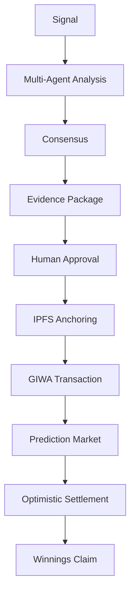
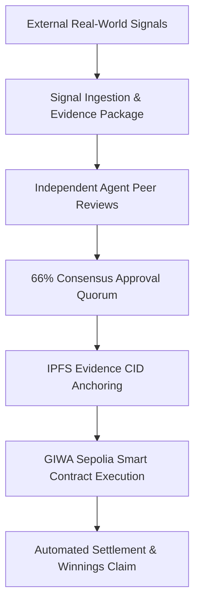

# AIRA Protocol: Executive Overview
### A Multi-Agent AI Decision Protocol for Transparent Prediction Markets, powered by GIWA.

> [!IMPORTANT]
> **30-Second Summary**
> AIRA Protocol enables transparent AI-assisted prediction markets where multiple specialized AI agents independently evaluate the available evidence, produce transparent reasoning, reach consensus, and anchor evidence on GIWA before a market is created. Rather than relying on opaque AI outputs, AIRA exposes the reasoning, supporting evidence, and consensus process behind every approved market before it is executed on GIWA.

| Parameter | Status / Details |
| :--- | :--- |
| **Network** | GIWA Sepolia Testnet (Chain ID: `91342`) |
| **Deployment** | Verified (`0xBDCd79e468a05BaD60cc0822Df42c11B4e0E4f3D`) |
| **Explorer** | Available ([GIWA Explorer](https://sepolia-explorer.giwa.io)) |
| **Wallet** | RainbowKit / Wagmi / Viem |
| **Status** | Live MVP |

---

## What Makes AIRA Different?

Unlike traditional prediction markets that rely on manual market creation or opaque AI systems, AIRA combines:

- **Multi-agent AI reasoning** instead of a single AI response.
- **Transparent evidence packages** that can be independently inspected.
- **On-chain verification through GIWA** for settlement and auditability.
- **Human-in-the-loop approval** before market deployment.

This approach transforms AI-assisted prediction markets into transparent and verifiable decision systems.

---

## End-to-End Decision Lifecycle

`Signal` ➔ `Multi-Agent Analysis` ➔ `Consensus` ➔ `Evidence Package` ➔ `Human Approval` ➔ `IPFS` ➔ `GIWA Transaction` ➔ `Prediction Market` ➔ `Settlement` ➔ `Claim`

---

## 1. Why This Is Important

Traditional prediction markets and decentralized decision platforms face three major bottlenecks:

1. **Manual Market Creation**: Creating prediction markets is still largely manual, making it slow to react to fast-moving real-world events.
2. **Hard-to-Verify AI Decisions**: AI-generated decisions are difficult to verify when outputs are produced inside opaque black boxes.
3. **Lack of Decision Visibility**: Users have little visibility into how AI reached a conclusion or what evidence was evaluated.

### **The AIRA Solution**
**AIRA allows multiple AI agents to independently evaluate the available evidence, explain their reasoning, reach consensus, preserve supporting evidence, and anchor that evidence on GIWA.**

Instead of trusting a single prompt or an opaque black box, specialized AI agents evaluate real-world signals, calculate risk parameters, and verify compliance rules. Every decision audit trail is anchored on-chain to **GIWA Sepolia L2**, giving users complete visibility into how conclusions were reached.

---

## 2. Why GIWA?

AIRA uses GIWA as its execution and verification layer.

Every approved market, evidence package, and settlement transaction is verifiably anchored on GIWA, creating a transparent execution trail from AI reasoning to on-chain settlement.

---

## 3. Current MVP Scope

- **Live deployment on GIWA Sepolia Testnet** (`0xBDCd79e468a05BaD60cc0822Df42c11B4e0E4f3D`).
- **AI-assisted proposal generation** with natural language signal analysis.
- **Multi-agent consensus workflow** (Analyst, Risk, Compliance agents).
- **Evidence packaging with IPFS support** for auditable multihashes.
- **On-chain market creation, optimistic dispute resolution, and payout settlement**.
- **Protocol Explorer and audit interface**.

### Future Roadmap
- **Expanded AI providers** (Gemini Pro, GPT-4o, Anthropic Claude).
- **Additional market categories** and dynamic signal feeds.
- **Enhanced analytics and governance** features.
- **Mainnet deployment** following successful testnet evaluation.

---

## 4. Core Capabilities & User Value

- **Independent Multi-Agent Peer Reviews**: Multiple AI agents evaluate signal inputs and peer-review every proposal, requiring a 66% consensus quorum before creating a market.
- **Verifiable Decision Audit Trail**: Every evidence item, agent evaluation, and confidence score is anchored with an IPFS CID and logged transparently on-chain.
- **Instant Micro-Liquidity Seeding**: Markets are pre-funded with `0.000002 GIWA` seed liquidity on block zero, enabling micro-orders (`0.00002 GIWA`) without high faucet barriers.
- **Clear Outcome & Winnings Payouts**: Traders can track active predictions, verify `WON` or `LOST` statuses, and claim payouts directly into their Web3 wallets.

---

## 5. How It Is Implemented (Technical Architecture)

The protocol decouples off-chain cognitive evaluation from on-chain asset custody across four core layers:

### **Component Layer Breakdown:**

1. **Off-Chain Multi-Agent Consensus Swarm**:
   - **`AnalystAgent`**: Ingests raw signal data and models baseline probability estimates.
   - **`RiskAgent`**: Audits order book depth, volatility indices, and safety circuit breakers.
   - **`ComplianceAgent`**: Enforces oracle dispute rules, timelocks, and protocol compliance.

2. **On-Chain Settlement Engine (`AiraMarketProtocol.sol`)**:
   - The `AiraMarketProtocol` contract manages market creation, liquidity, trading, dispute resolution, and payout settlement on GIWA.
   - Deployed at `0xBDCd79e468a05BaD60cc0822Df42c11B4e0E4f3D` on GIWA Sepolia L2 (Chain ID: `91342`).

3. **Storage & Audit Layer**:
   - Supports IPFS evidence anchoring for metadata logs and cryptographic multihash verification.

4. **Seven Integrated Application Modules**:
   - **Core Feed (`/feed`)**: 4 category streams with status filters and mobile stream view.
   - **AI Creator Lab (`/creator`)**: Prompt-to-market creator with live wallet signing.
   - **Trading Terminal (`/terminal`)**: Interactive probability charts and Decision Timeline.
   - **Protocol Explorer (`/explorer`)**: 4-tab verifiable audit reports per proposal.
   - **Decision Transparency Registry (`/leaderboard`)**: Swarm node calibration metrics, connected participant wallets, and protocol activity.
   - **Portfolio (`/portfolio`)**: Win/Loss outcome verification and 1-click payout claims.

---

## 6. Summary

AIRA Protocol demonstrates a complete end-to-end MVP built on GIWA Sepolia, combining AI-assisted decision making, transparent evidence workflows, and on-chain execution into a unified protocol ready for technical evaluation.

---

## Resources

- **GitHub Repository**: [0xaje/AiraMarKet](https://github.com/0xaje/AiraMarKet)
- **Live Testnet Contract**: [`0xBDCd79e468a05BaD60cc0822Df42c11B4e0E4f3D`](https://sepolia-explorer.giwa.io/address/0xBDCd79e468a05BaD60cc0822Df42c11B4e0E4f3D)
- **Block Explorer**: [GIWA Sepolia Explorer](https://sepolia-explorer.giwa.io)
- **Documentation**: [Developer Documentation Hub](file:///home/oyeolorun/AiraMarKet/docs/developer/architecture_overview.md)
