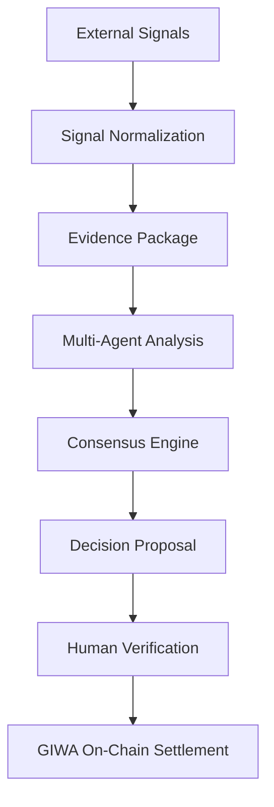
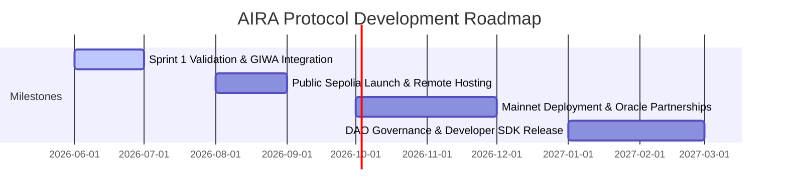

# AIRA Protocol: Executive Overview
### The Autonomous Intelligence & Risk Analysis Protocol

---

## 1. Mission & Vision

### Mission
To democratize and automate the creation and settlement of verifiable decision proposals by deploying secure, autonomous AI agents to evaluate global real-world events and establish trustless consensus opportunities.

### Vision
A decentralized information layer where public knowledge, decisions, and outcomes are formulated programmatically and verified cryptographically without intermediary gatekeepers, enabling instantaneous, global risk management for any real-world event.

---

## 2. Market Opportunities & Challenges

### The Problem
Traditional prediction and decision markets face systemic barriers that prevent mainstream adoption:
1.  **High Operational Friction & Content Scarcity**: Setting up proposals requires manual research, rule-drafting, and slow administrative approval. This delay limits the system's ability to respond to breaking news or micro-events.
2.  **The "Cold Start" Liquidity Trap**: Early-stage decision pools suffer from low trading volumes and high price volatility. Early participants face extreme price slippage, which deters trade volume and halts organic ecosystem growth.
3.  **Centralized Settlement Risks**: Traditional platforms rely on centralized resolution mechanisms or slow human juries. This introduces counterparty risk, opaque decisions, and long payout delays.

### The Solution
The AIRA Protocol removes these bottlenecks by merging autonomous AI logic with trustless blockchain settlement:
1.  **Autonomous Heuristics**: Category-specific AI agents monitor global information streams (such as news APIs and social platforms) to programmatically draft structured decision proposals instantly as events unfold.
2.  **Native Liquidity Seeds**: Every new proposal is deployed with contract-level pre-seeded liquidity split equally across YES/NO pools. This guarantees balanced bonding curves and stable pricing from block zero.
3.  **Verifiable AI & Optimistic Oracles**: To ensure complete transparency, the AI's inputs and reasoning are hashed and anchored on-chain via IPFS. Resolutions are governed by a decentralized optimistic oracle where proposers stake slashing bonds, ensuring economic alignment.

---

## 3. High-Level Architecture & Pipeline Flow

The protocol is structured into four decoupled operational layers:
*   **Off-Chain Ingestion & Evidence Layer**: Gathers unstructured real-world signals and compiles them into structured, queryable **Evidence Packages** (containing normalized signal details, metadata origins, timestamps, and confidence data).
*   **Off-Chain Intelligence Layer**: Specialized AI agents run Multi-Agent Analysis and consensus checks against Evidence Packages to form decision proposals.
*   **On-Chain Settlement Layer**: The smart contract acts as the final arbiter of asset custody, locking native token seed pools and settling payouts.
*   **Stateless Synchronization Layer**: A high-speed indexer polls the blockchain and records event logs to a relational database with transaction-level idempotency.

The protocol is governed by an 8-stage unified protocol lifecycle:

---

## 4. Why GIWA

The AIRA Protocol relies on Dunamu's **GIWA OP Stack L2** network as its core settlement layer. The network provides specific advantages crucial to off-chain verifiable AI systems:
*   **Efficient Settlement**: Enables low-gas, pari-mutuel pool creations, micro-trades, and dispute settlements that are economically unviable on Ethereum Layer 1.
*   **Verifiable AI Execution**: Low execution fees support the frequent administrative signatures required to commit consensus proposals trustlessly.
*   **Low-Cost On-Chain Evidence Anchoring**: Allows the permanent anchoring of detailed IPFS Content Identifiers (CIDs) mapping to Evidence Packages and agent audits directly within event log states, establishing complete public transparency.
*   **Developer Experience**: Combines standard EVM tooling compatibility (ethers, viem, Hardhat) with high RPC transaction processing speeds, streamlining sandbox testing and contract verification.
*   **Scalable Execution**: Rapid block times facilitate high transaction throughput, ensuring consensus engine proposals are queued and initialized with sub-second finality.
*   **Future Protocol Expansion**: The OP Stack's scalable design aligns with future protocol updates, including Multi-Party Computation (MPC) administrative multi-sigs and Zero-Knowledge (ZK) execution verification tools.

---

## 5. Current Progress & Commercialization

### Current Progress
*   **Core Protocol Ready**: Smart contracts governing proposal lifecycles, pooled liquidity, and winnings claims are fully validated on public testnet infrastructure.
*   **Autonomous Ingestion Live**: Category-specific agents are actively monitoring signal streams and generating verifiable decision proposals.
*   **Hardened Infrastructure**: The platform backend is hardened with stateless HTTP JSON-RPC polling, PostgreSQL database persistence, and a 20% gas estimation safety margin to handle network congestion.
*   **Polished Interface**: The React client features mobile-responsive designs, Web3 wallet support, and real-time transaction notifications linked to block explorers.

---

## 6. Strategic Roadmap

*   **Phase 1 (Completed)**: Core smart contract validation, local sandbox development, multi-agent consensus engine implementation, testnet deployment, and event indexer hardening.
*   **Phase 2 (Q3 2026)**: Deploying the backend to remote hosting, upgrading to production AI APIs, and launching the public sandbox on GIWA Sepolia.
*   **Phase 3 (Q4 2026)**: Deploying to GIWA Mainnet, integrating third-party decentralized oracle networks, and initiating liquidity provider incentives.
*   **Phase 4 (Q1 2027)**: Transitioning protocol parameters (fee splits, confidence thresholds) to a Decentralized Autonomous Organization (DAO) and releasing developer SDKs to allow partners to build custom AI agents.

---

## Protocol Verification Metrics

The following metrics represent verified protocol capabilities and testing outcomes:
*   **Infrastructure & Integration**:
    *   `[x]` Multi-chain architecture configuration
    *   `[x]` Dunamu's GIWA L2 integration verified
    *   `[x]` Production diagnostics & health monitoring active
    *   `[x]` Standardized structured logging implemented
*   **Consensus & Intelligence**:
    *   `[x]` Multi-Agent Consensus Engine implemented
    *   `[x]` Three specialized AI agents (Analyst, Risk, Compliance) active
    *   `[x]` Collaborative consensus thresholds implemented (66% approval quorum)
    *   `[x]` Agent evaluation reasoning persisted in database cache
*   **Code Quality & Verification**:
    *   `[x]` 9/9 smart contract unit tests passing
    *   `[x]` 5/5 consensus engine integration tests passing
    *   `[x]` Production frontend build compiled and verified

