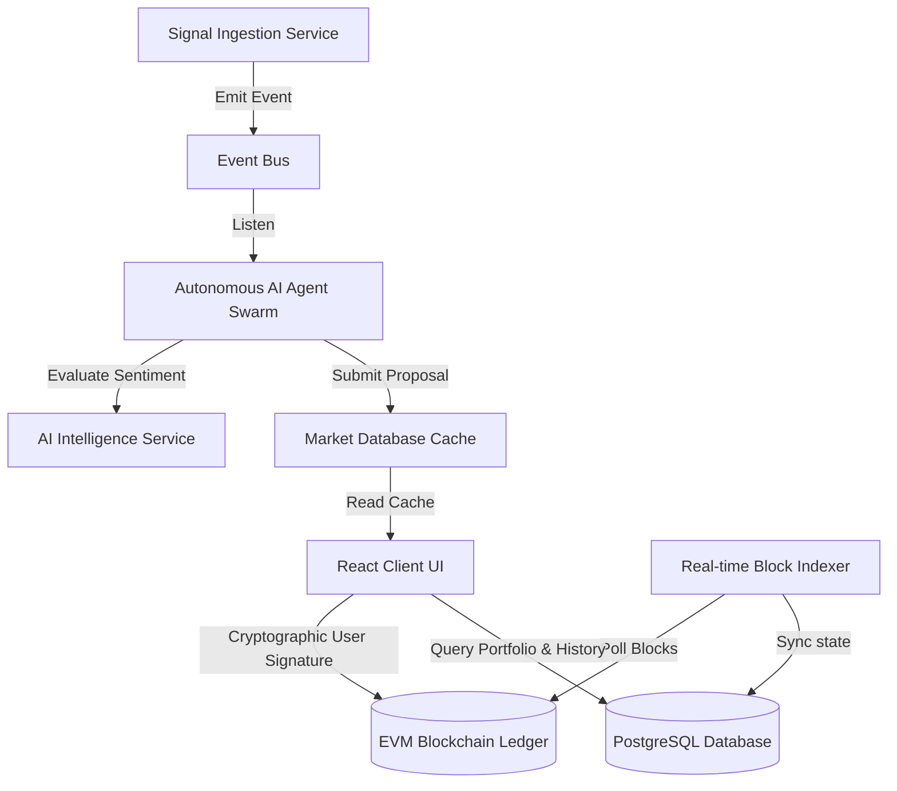

# Architecture Overview

AIRA Markets is a prediction market protocol built using a modular, chain-agnostic Web3 design.

## System Architecture

### 1. On-Chain Settlement Layer (Solidity Contracts)
- Managed by `AiraMarketProtocol.sol`.
- Implements market creation pooling, YES/NO token balance tracking, optimistic resolution, and proportional rewards redemption.

### 2. Provider & Contract Factories (`/services`)
- **ProviderFactory**: Caches JSON-RPC providers, manages connection latency logs, and executes connection retries.
- **ContractFactory**: Resolves deployment contracts dynamically, checks address formatting, loads corresponding ABIs, and returns instantiated `ethers.Contract` objects.

### 3. Backend Agent Layer (`/server`)
- **Signal Ingestion**: Periodically streams data feeds from HackerNews, ESPN, CoinGecko, and Reddit.
- **AI Sentiment Engine**: Formulates prediction titles and outputs confidence ratings based on trend volumes.
- **Diagnostics Validation**: Assures that RPC, database, files, and wallet keys are healthy on boot.
