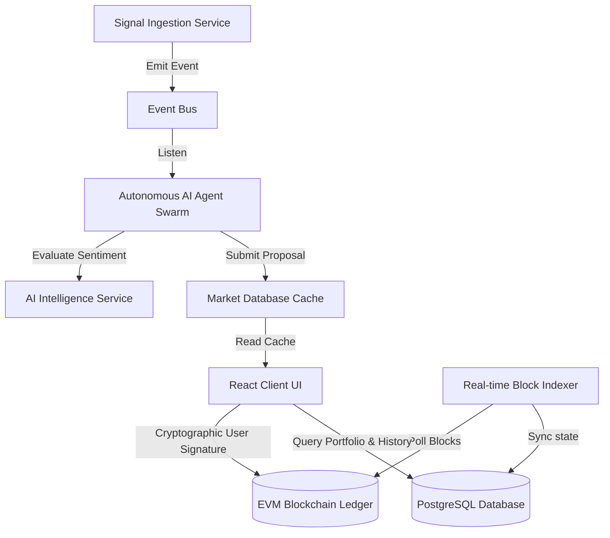

# System Architecture Overview
### Powered by GIWA

---

## 1. Executive Summary

### Why This Exists
Large-scale decentralized prediction platforms face scalability and data-throughput bottlenecks. This **Architecture Overview** exists to detail the modular, high-performance layers of the AIRA Protocol.

### What Problem It Solves
It solves the complexity of bridging real-world web data with smart contract execution. By dividing the protocol into three clear tiers—Data Ingestion, Multi-Chain Abstraction, and On-Chain Settlement—it ensures that network latency and data processing are managed efficiently off-chain while the settlement layer guarantees secure asset custody on-chain.

### Why It Matters
A modularized, clean design ensures that the protocol is highly maintainable, auditable, and extensible. It enables developers to swap data ingestion modules, integrate new AI models, or expand to additional L2 layers without affecting the core settlement contract, guaranteeing system stability.

### How It Benefits GIWA
- **Flagship Execution Demonstrator**: This architecture showcases how the fast block times and low transaction fees of Dunamu's **GIWA OP Stack L2** support high-frequency prediction markets that would be cost-prohibitive on L1 networks.
- **Optimized Event Indexing**: The event indexer leverages GIWA's reliable RPC responses, ensuring real-time client UI synchronicity.

---

## 2. Core Architecture Tiers

### 1. Assisted Intelligence Tier (Node.js/TypeScript)
- **Ingestion Module**: Periodically streams signals from CoinGecko, Hacker News, ESPN, and Reddit.
- **AI Sentiment Service**: Processes and structures news feeds into binary market definitions.
- **Agent Swarm**: Category-specific agents that analyze confidence metrics before submitting suggestion payloads.

### 2. Multi-Chain Abstraction Tier
- **Registry configurations (`/config/chains`)**: Dynamically resolves RPC URLS, explorer configs, and contract parameters by network.
- **Object Factories (`/services`)**: Caches JSON-RPC instances and validates EIP-55 address formats.

### 3. On-Chain Settlement Tier (Solidity)
- **`AiraMarketProtocol.sol`**: Governs reward distributions, YES/NO shares, and optimistic resolutions.
